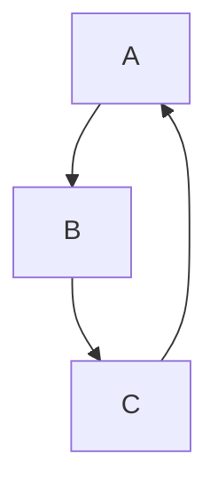
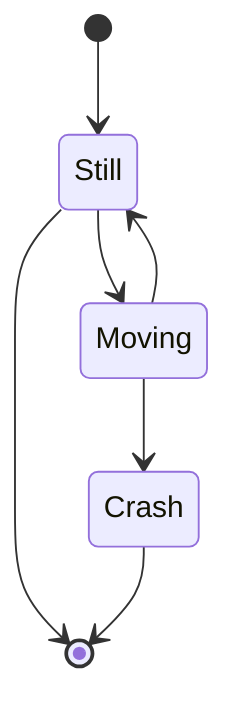
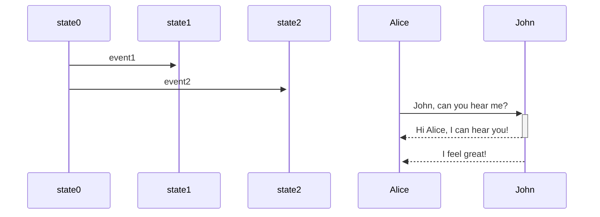

# 使用mermaid绘图

```mermaid
graph TB;
 A-->B
 B-->C
 C-->A
```

```mermaid
stateDiagram-v2
    [*] --> Still
    Still --> [*]
    Still --> Moving
    Moving --> Still
    Moving --> Crash
    Crash --> [*]
```

## 事件驱动状态机

### 事件分为外部事件和内部事件

```mermaid
sequenceDiagram
    state0->>+state1: event1
    state0->>+state2: event2
    Alice->>+John: John, can you hear me?
    John-->>-Alice: Hi Alice, I can hear you!
    John-->>+Alice: I feel great!
```
